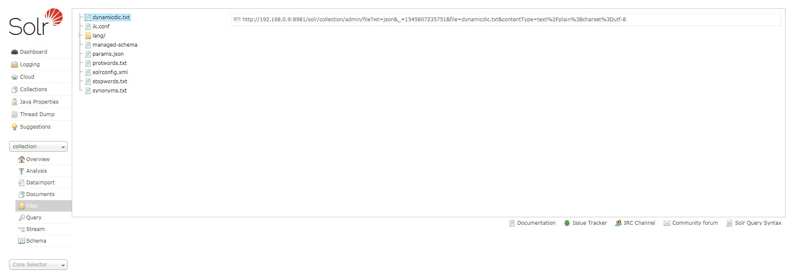
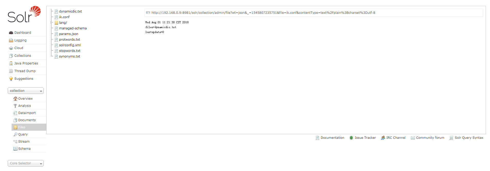
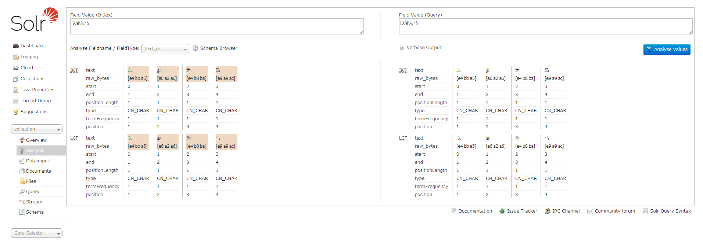
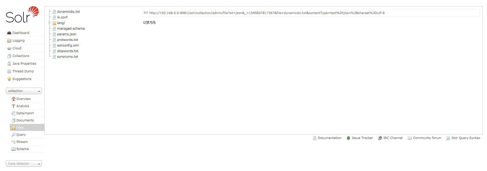
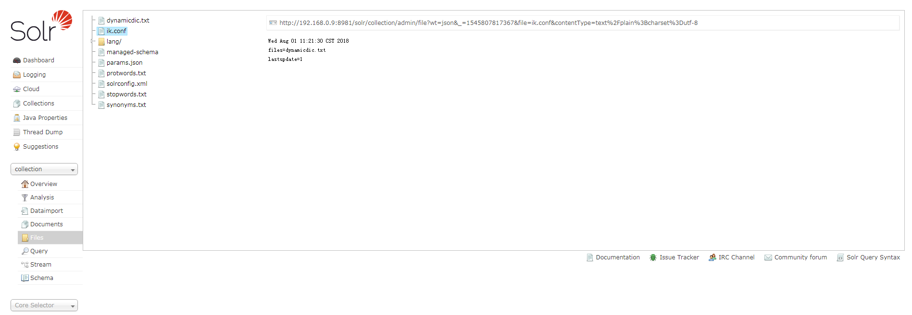
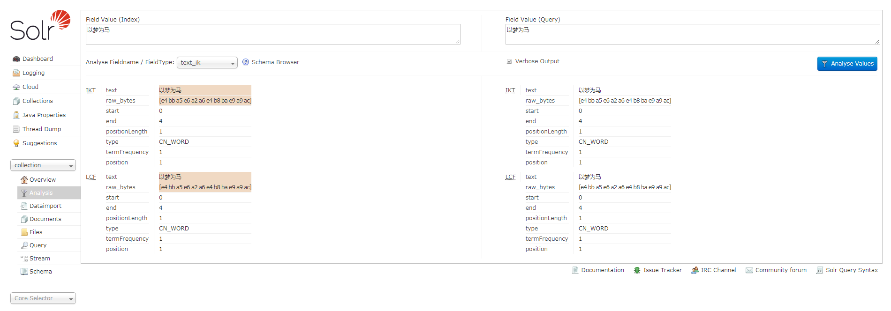

## Solr-Cloud说明

##### 因为`Solr-Cloud`中的配置文件是交由`zookeeper`进行管理的， 所以为了方便更新动态词典， 所以也要将动态词典文件上传至`zookeeper`中，目录与`solr`的配置文件目录一致。

#### 注意：因为`zookeeper`中的配置文件大小不能超过`1m`，当词典列表过多时，需将词典文件切分成多个。


1. 将jar包放入每台服务器的Solr服务的`Jetty`或`Tomcat`的`webapp/WEB-INF/lib/`目录下；

2. 将`resources`目录下的`IKAnalyzer.cfg.xml`、`ext.dic`、`stopword.dic`放入solr服务的`Jetty`或`Tomcat`的`webapp/WEB-INF/classes/`目录下；
    ```console
    ① IKAnalyzer.cfg.xml (IK默认的配置文件，用于配置自带的扩展词典及停用词典)
    ② ext.dic (默认的扩展词典)
    ③ stopword.dic (默认的停词词典)
    ```
    注意：与单机版不同，`ik.conf`及`dynamicdic.txt`请不要放在`classes`目录下！

3. 将`resources`目录下的`ik.conf`及`dynamicdic.txt`放入solr配置文件夹中，与solr的`managed-schema`文件同目录中；
    ```console
        ① ik.conf (动态词典配置文件)
            files (动态词典列表，可以设置多个词典表，用逗号进行分隔，默认动态词典表为dynamicdic.txt)
            lastupdate (默认值为0，每次对动态词典表修改后请修改该值，必须大于上次的值，不然不会将词典表中新的词语添加到内存中。)
        ② dynamicdic.txt (默认的动态词典，在此文件配置的词语不需重启服务即可加载进内存中。以#开头的词语视为注释，将不会加载到内存中。)
    ```

4. 配置Solr的`managed-schema`，添加`ik分词器`，示例如下；
   ```console
   <!-- ik分词器 -->
   <fieldType name="text_ik" class="solr.TextField">
     <analyzer type="index">
         <tokenizer class="org.wltea.analyzer.lucene.IKTokenizerFactory" useSmart="false" conf="ik.conf"/>
         <filter class="solr.LowerCaseFilterFactory"/>
     </analyzer>
     <analyzer type="query">
         <tokenizer class="org.wltea.analyzer.lucene.IKTokenizerFactory" useSmart="true" conf="ik.conf"/>
         <filter class="solr.LowerCaseFilterFactory"/>
     </analyzer>
   </fieldType>
   ```

5. 将配置文件上传至`zookeeper`中，首次使用请重启服务或reload Collection。

6. 测试分词：
    * 此时的动态词典文件为空
    
    * 配置文件lastupdate为0
    
    * 测试分词
    

7. 测试动态词典：
    * 增加动态词典词语并上传至`zookeeper`
    
    * 修改配置文件并上传至`zookeeper`
    
    * 测试分词
    
