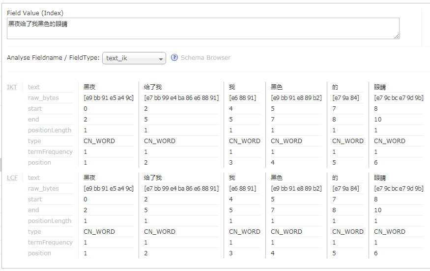

# ik-analyzer-solr
ik-analyzer for solr 7.x-8.x

<!-- Badges section here. -->
[](https://search.maven.org/search?q=g:com.github.magese%20AND%20a:ik-analyzer&core=gav)
[](https://github.com/magese/ik-analyzer-solr/releases)
[](./LICENSE)
[](https://travis-ci.org/magese/ik-analyzer-solr)
[](http://hits.dwyl.io/magese/ik-analyzer-solr)

[](https://github.com/magese/ik-analyzer-solr/network/members)
[](https://github.com/magese/ik-analyzer-solr/stargazers)
<!-- /Badges section end. -->

## 简介
**适配最新版本solr 7&8；**

**扩展IK原有词库：**

| 分词工具 | 词库中词的数量 | 最后更新时间 |
| :------: | :------: | :------: |
| ik | 27.5万 | 2012年 |
| mmseg | 15.7万 | 2017年 |
| word | 64.2万 | 2014年 |
| jieba | 58.4万 | 2012年 |
| jcesg | 16.6万 | 2018年 |
| sougou词库 | 115.2万 | 2020年 |

**将以上词库进行整理后约187.1万条词汇；**

**添加动态加载词典表功能，在不需要重启solr服务的情况下加载新增的词典。**

> <small>关闭默认主词典请在`IKAnalyzer.cfg.xml`配置文件中设置`use_main_dict`为`false`。</small>
> * IKAnalyzer的原作者为林良益<linliangyi2007@gmail.com>，项目网站为<http://code.google.com/p/ik-analyzer>
> * 该项目动态加载功能根据博主[@星火燎原智勇](http://www.cnblogs.com/liang1101/articles/6395016.html)的博客进行修改，其GITHUB地址为[@liang68](https://github.com/liang68)


## 使用说明
* jar包下载地址：[](https://search.maven.org/remotecontent?filepath=com/github/magese/ik-analyzer/8.4.0/ik-analyzer-8.4.0.jar)
* 历史版本：[](https://search.maven.org/search?q=g:com.github.magese%20AND%20a:ik-analyzer&core=gav)

    ```xml
    <!-- Maven仓库地址 -->
    <dependency>
        <groupId>com.github.magese</groupId>
        <artifactId>ik-analyzer</artifactId>
        <version>8.4.0</version>
    </dependency>
    ```

### Solr-Cloud
* [Solr-Cloud说明](./README-CLOUD.md)

### 单机版Solr
1. 将jar包放入Solr服务的`Jetty`或`Tomcat`的`webapp/WEB-INF/lib/`目录下；

2. 将`resources`目录下的5个配置文件放入solr服务的`Jetty`或`Tomcat`的`webapp/WEB-INF/classes/`目录下；
    ```console
    ① IKAnalyzer.cfg.xml
    ② ext.dic
    ③ stopword.dic
    ④ ik.conf
    ⑤ dynamicdic.txt
    ```

3. 配置Solr的`managed-schema`，添加`ik分词器`，示例如下；
    ```xml
    <!-- ik分词器 -->
    <fieldType name="text_ik" class="solr.TextField">
      <analyzer type="index">
          <tokenizer class="org.wltea.analyzer.lucene.IKTokenizerFactory" useSmart="false" conf="ik.conf"/>
          <filter class="solr.LowerCaseFilterFactory"/>
      </analyzer>
      <analyzer type="query">
          <tokenizer class="org.wltea.analyzer.lucene.IKTokenizerFactory" useSmart="true" conf="ik.conf"/>
          <filter class="solr.LowerCaseFilterFactory"/>
      </analyzer>
    </fieldType>
    ```

4. 启动Solr服务测试分词；

    

5. `IKAnalyzer.cfg.xml`配置文件说明：

    | 名称 | 类型 | 描述 | 默认 |
    | ------ | ------ | ------ | ------ |
    | use_main_dict | boolean | 是否使用默认主词典 | true |
    | ext_dict | String | 扩展词典文件名称，多个用分号隔开 | ext.dic; |
    | ext_stopwords | String | 停用词典文件名称，多个用分号隔开 | stopword.dic; |

6. `ik.conf`文件说明：
    ```properties
    files=dynamicdic.txt
    lastupdate=0
    ```

    1. `files`为动态词典列表，可以设置多个词典表，用逗号进行分隔，默认动态词典表为`dynamicdic.txt`；
    2. `lastupdate`默认值为`0`，每次对动态词典表修改后请+1，不然不会将词典表中新的词语添加到内存中。<s>`lastupdate`采用的是`int`类型，不支持时间戳，如果使用时间戳的朋友可以把源码中的`int`改成`long`即可；</s> `2018-08-23` 已将源码中`lastUpdate`改为`long`类型，现可以用时间戳了。

7. `dynamicdic.txt` 为动态词典

    在此文件配置的词语不需重启服务即可加载进内存中。
    以`#`开头的词语视为注释，将不会加载到内存中。


## 更新说明
- **2021-05-26:** 小红牛逼
- **2021-03-22:** 升级lucene版本为`8.4.0`
- **2020-12-30:**
    - 升级lucene版本为`8.3.1`
    - 更新词库
- **2019-11-12:** 
    - 升级lucene版本为`8.3.0`
    - `IKAnalyzer.cfg.xml`增加配置项`use_main_dict`，用于配置是否启用默认主词典
- **2019-09-27:** 升级lucene版本为`8.2.0`
- **2019-07-11:** 升级lucene版本为`8.1.1`
- **2019-05-27:** 
    - 升级lucene版本为`8.1.0`
    - 优化原词典部分重复词语
    - 更新搜狗2019最新流行词汇词典，约20k词汇量
- **2019-05-15:** 升级lucene版本为`8.0.0`，并支持Solr8使用
- **2019-03-01:** 升级lucene版本为`7.7.1`
- **2019-02-15:** 升级lucene版本为`7.7.0`
- **2018-12-26:** 
    - 升级lucene版本为`7.6.0`
    - 兼容solr-cloud，动态词典配置文件及动态词典可交由`zookeeper`进行管理
    - 动态词典增加注释功能，以`#`开头的行将视为注释
- **2018-12-04:** 整理更新词库列表`magese.dic`
- **2018-10-10:** 升级lucene版本为`7.5.0`
- **2018-09-03:** 优化注释与输出信息，取消部分中文输出避免不同字符集乱码，现会打印被调用inform方法的hashcode
- **2018-08-23:**
    - 完善了动态更新词库代码注释；
    - 将ik.conf配置文件中的lastUpdate属性改为long类型，现已支持时间戳形式
- **2018-08-13:** 更新maven仓库地址
- **2018-08-01:** 移除默认的扩展词与停用词
- **2018-07-23:** 升级lucene版本为`7.4.0`


## 感谢 Thanks

[](https://www.jetbrains.com/?from=ik-analyzer-solr)

[](https://www.java.com)


## BUG & 疑问 & 其它
如果您在使用过程中遇到了BUG，或者有不清楚的地方，请挂ISSUE或者联系作者：<magese@live.cn>

如果您觉得该项目对您有帮助，请别忘记给这个项目一个`star`
